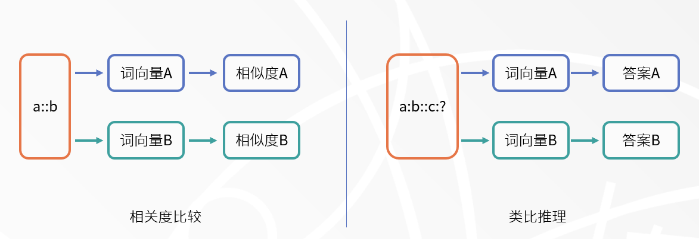
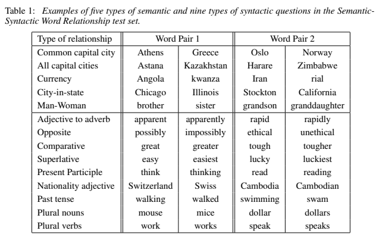
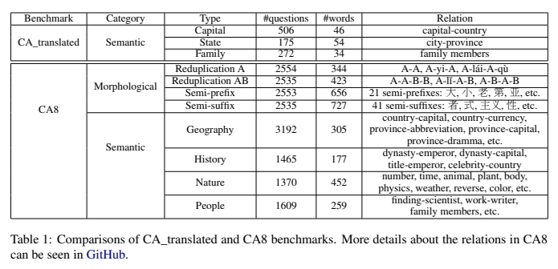

> （把每双周周报在BLOG上整理一下，以防止自己做的PPT最后都想不起来是在说什么。）

词向量的评估是个人比较感兴趣的方向，好像也是比较冷门的方向。虽然这一领域目前没有公认方案，但实际上由于大规模语言模型的迅速发展，可以将上下文进行融合进词的动态词表征被广泛的使用，静态词表征的相关研究一直处在冷门状态。

<!-- more -->

# 词向量及其评估

## 词向量

词向量（Word Embedding/Vector）又或者翻译成词嵌入，对于大部分从事相关工作的人来说应该不是一个陌生的概念。其主要作用是将自然语言中的词用一个向量表示，并且希望这个向量的维数可以小一点，还能再包含一些语义信息的话就更好了。比如这个经典的例子：

$$
\text{king} - \text{man} + \text{women} \approx \text{queen}
$$

我们希望训练出来的词向量就可以包含上述的信息，如果词向量能携带更多这种信息的话，那应该对后续的模型有更大帮助。

当然，随着 BERT/GPT 等语言模型的高速发展，它们可以生成包含上下文信息的词向量。由于在预训练语言模型是使用了大量的数据，这些基于 BERTology 的语言模型有着非常好的性能，现已作为很多后续任务的特征提取部分。

文本主要讨论的是前者，也就是**静态词向量**。它不随词汇所在句子而改变其表征。

## 词向量的评估

词向量的评估一直是一个比较棘手的问题，因为词向量没有黄金标准，无法通过简单的分类或者回归任务对其进行建模，从而无法给出一个公认评估方式。但换种角度，一个好的词向量应该可以在多种任务上都能取得不错的表现。由此，评价一个词向量的方法主要分为两种：外在评估（Extrinsic Evaluation）与内在评估（Intrinsic Evaluation）。

### 外在评估

外在评估就是将词向量在多种下游任务中进行实验，通过与其他词向量的实验结果进行比较，从而得出哪个模型的性能更好。这个思路是相对更加直接的。

但其显然存在很多问题：

- 实验步骤繁琐，需要大量实验才能证明某一词向量的优越性。
- 需要基线进行对比，无法为单一词向量给出评价。
- 干扰变量过多，在实验中控制变量会非常困难。

因此，内在评估就显得格外重要。

### 内在评估

内在评估就是直接测试词向量之间的句法和语义联系。概念倒是很直接，但如何测试句法联系和语义联系就变得非常困难。目前内在评估主要分为：相关度比较与类比推理两种。

#### 相关度比较

相关度比较是指给出一组包含若干个词语对的测试集合，每个词语对有若干个人类评分作为标准答案。在评价某一词向量方案时，计算两向量的相似度与人类评分的相关性即可。

但显然，相关度比较方案最大的问题就是，该方案需要大量的人力资源，想获得大量的标注数据成本过高。另外，评价两个词是否相似存在严重的主观性，两个词的相似性在不同的语言环境中也有不同。

#### 类比推理

类比推理是指让模型进行类比推理，比较模型给出的答案与人类标准答案，从而判断模型的性能。我们再用前面的例子进行解释：通过让模型计算 $\text{man}:\text{king}::\text{women}:?$ 。如果模型给出的向量计算结果与 $\text{queen}$ 这个向量相近的话，那么就认为词向量是正确的。通过若干道这种题目，判断词向量质量。

# 部分词向量评估方案

## 类比推理评估

论文原文：Efficient Estimation of Word Representations in Vector Space[^1]

该方案与 Word2Vector 在同一篇文章中被提出，用以评估 Word2Vector 的性能。该方案中的题目大概分为两部分，一部分是世界知识：国家与首都、城市与州、男性与女性等等；而另一部分则是英文语法，例如过去时态、名词单复数等等。

但该数据集中的词汇过于局限于英文环境，因此在其他语言中需要另外设计题目，迁移性较差。

## 引入词形学的类比推理评估

论文原文：Analogical Reasoning on Chinese Morphological and Semantic Relations[^2]

这是一个针对中文词向量数据集研究，针对中文中的叠词等词形学变化，在上文类比推理的基础上加入了这部分测试内容，构成如下测试集合。可以发现这种测试数据更为符合中文的词向量情况。

该方法和其他类比推理的方法一样，其局限性在于仅针对中文环境，在其他语言中需要另外设计题目，迁移性较差。

## 分类模块度

论文原文：Evaluating Word Embeddings with Categorical Modularity[^3]

该方法为静态词向量的内在评估提出一种新的方法。该方法首先选定若干类别，每个类别内有若干单词。从词向量中获取这些单词对应的向量，将单词相连构成网络。最后根据类别将网络划分成多个社区，计算其模块度。

这篇文章中的另一个亮点是使用了神经生物学的相关研究，这篇文章中所选的类别来自Binder Categories[^4]。该分类方法根据分析人脑对不同词汇的反应进行分类，本文使用这种该方法与无监督的社区划分做对比，得出该方法的效果更好。

该方法虽然用实验展示了一种非常新颖的词向量评估方法，但仍存在一部分问题，或者说研究不充分的地方。

1. **未考虑一词多义的情况：**在大部分语言中，一个词通常包含多个意思。即使在Binder Categories中，部分词汇仍然有其他含义，使得该词汇从一个类别跳到另一个类别。
2. **无法扩展至其他语言：**虽然文中通过机器翻译的方法将模块度评估方法扩展至其他语言，但经过本人阅读词表后发现，该词表中包含与文化关系密切的词汇。这些词汇在部分国家中可能无法翻译成非常恰当合适的词汇。
3. **实验未考虑深度学习模型：**文中针对词向量评估方法的验证仅停留在SVM等传统方法上。针对深度学习模型，尤其是大规模预训练语言模型的验证则更加实际。

# 讨论

## 针对类比推理方案的质疑

论文原文：The (too Many) Problems of Analogical Reasoning with Word Vectors[^5]

近来这篇文章质疑类比推理方法评价词向量存在一些问题，而这些问题被有意无意忽略了，导致类比推理评价方法的说服力大大减弱。类比推理方法相当于找到下式中最接近 $b'$ 的向量所表示的词汇。

$$
a - a' + b \approx b'
$$

这篇文章通过大量实验，发现如下几个问题。

1. $a-a'$ 无法对 $b$ 形成足够的偏移。导致事实上最接近 $a - a' + b$ 的向量应该是 $b$ 而不是 $b'$。这其实是与我们的期望相违背的。
2. $a,a',b,b'$ 间的相似度会影响预测准确率。当这四个向量越接近，预测的准确率越高。这一说明类比推理其实并没有起到作用。
3. 在候选集合里排除 $a,a',b$ 会导致错误。例如下面的表达式，答案应该为$\text{white}$，但该向量已经被排除，所以永远无法得到正确的答案。

$$
\text{snow} : \text{white} = \text{sugar} : ?
$$

由此说明类比推理方法虽然看起来很合理，但实际上仍然存在巨大缺陷。这也导致了静态词向量的内在评价陷入了瓶颈。

END

[^1]: Mikolov T ,  Chen K ,  Corrado G , et al. Efficient Estimation of Word Representations in Vector Space[J]. Computer Science, 2013.
[^2]: Li S ,  Zhao Z ,  Hu R , et al. Analogical Reasoning on Chinese Morphological and Semantic Relations[C]// Meeting of the Association for Computational Linguistics. 2018.
[^3]: Casacuberta S ,  Halevy K ,  Blasi D E . Evaluating Word Embeddings with Categorical Modularity[C]// Findings of the Association for Computational Linguistics: ACL-IJCNLP 2021. 2021.
[^4]: Binder J R ,  Conant L L ,  Humphries C J , et al. Toward a brain-based componential semantic representation[J]. Cognitive Neuropsychology, 2016:1-45.
[^5]: Rogers A ,  Drozd A ,  Li B . The (too Many) Problems of Analogical Reasoning with Word Vectors[C]// Proceedings of the 6th Joint Conference on Lexical and Computational Semantics (*SEM 2017). 2017.
