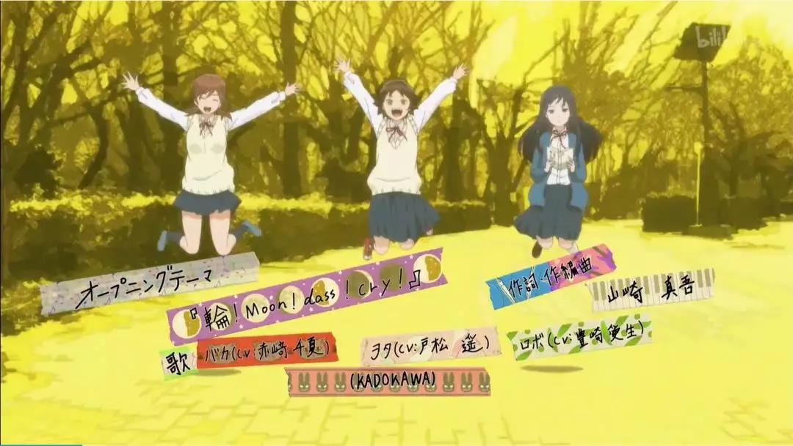
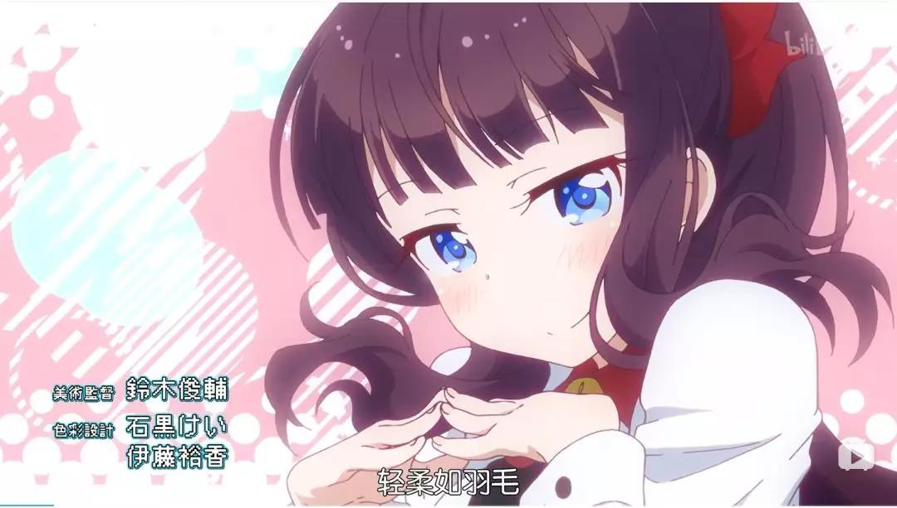


**发布于**：檐枫动漫社
**作者**：Santoin
**日期**：2019年10月26日
**原文链接**：[【投稿】动画OP与ED手法观察 - 檐枫动漫社](https://mp.weixin.qq.com/s/lvbCVQXobIQ8t6hfp5LIhw)


みなさんこんばんは。

第一次尝试写一点稍微有一点深度的文章。虽说最近看的新番越来越少，不过还是发现了一点有趣的事情，就记录下来了。大部分内容都来自于自己的理解，如果有什么错误也请多多指教。

对于一部番剧而言，如果说作画、剧情、配音是能否将一部作品称为优秀的评判标准的话。那 OP 和 ED ，就是吸引观众看番的比较重要的一部分了。

如何在短短的 90 秒内，充分展现作品的主题、背景，或者渲染好故事的气氛，做好足够的铺垫，一首合适的曲子以及一个合适的动画就显得比较重要。这篇文章主要会记录一些自己看到的一些OP或者ED的摄影手法，或者称作：视频制作手法。

<!-- more -->

# 动画OP与ED手法观察

当然，与现实世界常用的摄影手法相比，动画由于离现实更远，从而有更加广阔的创造空间，可以利用更丰富的想象力去创造一些不可能在现实中存在的画面。不过可以发现的是，有越来越多的现实世界的手法已经或多或少的运用在动画的 OP 与 ED 中。

## 1

让笔者突然有了想写一篇这样的文章，就来源于下面这个作品。不确定这种特效有没有什么名字，我们姑且称之为**光影特效**吧。（虽然说一般大家都会用《光影XX》作为作品的名字。）

说起来这种特效也简单，在现实环境中的添加一些不存在的**高光图形**。在制作过程中稍微注意光环境的改变给其他物品带来的影响。在《さらざんまい》这部作品的ED中，将这种光影效果与二渲三（姑且这么称呼吧）融合在一起。带来一种既在真实世界又仿佛有了一点不真实的感觉。

第二个让我想起写这样一篇文章的作品就是最近热播的《女子高中生的虚度日常》。当然，这个OP也有了各种各样的翻版。

但是定格动画在动画的应用其实很多。倒不如说定格动画就是低帧数的动画嘛。但这里所用的定格动画反倒在仿照着真实世界的拍摄方法所绘制的。

[https://www.bilibili.com/video/BV114411U72C](https://www.bilibili.com/video/BV114411U72C)

当然，这种效果拍摄起来也是很费力气的。不过这种意外的不真实感在现实世界广受好评。在动画中就又添了一番乐趣。

## 2

当然，还有一些其他方法，说不上什么借鉴于真实世界的摄影手法。不过却有一些在与动画不相关的领域中也会使用的方法。

这种在换场过程中，背景会像是重新构建世界一样拼贴出来的效果，在一些MG动画中，也是比较常用的手法。至少，这种转场的确比较方便。

《小泉同学》的OP还是很有MG风格的，这一段文字的转换就更加明显。准确的把握文字与其他元素的**运动与变换**是MG动画的核心。

一部形式奇特的讲述爱情的动画。当然，就这部动画的主题而言，OP 很准确的营造了这种特殊的气氛。有人把这种风格叫*超现实主义*或者*达达主义*。不过这种对真实存在的物品进行奇怪的调色，塑造的看似甜蜜的诡异气氛十分符合这一作品。

## 3

设计这种东西，每个人的想法和看法都不同，最后的成品也都不一样，也就不存在什么“通用手法”、“模板”，之类的东西。也许和以往的一小点不一样，就足以吸引眼球。

这里的一小点不一样就是突然丰富的动画。但不得不说，能驾驭这样的画面可见作画功底了得。也对之后使用这种风格的作品带来了更大的挑战。如果让动画流畅又不做作是一大难题。

当然，感觉越来越多的作品把注意力放在经常会挡住画面的 Staff 表。将 Staff 巧妙地融入到画面中就成了这些作品的特点。不过，总觉得这样让NCOP吸引力略微下降了x

## 4

不过话说回来，虽然有各种各样可以拿来使用的风格模式可以让现有的动画增加那么一点点亮点。不过，扎实的作画、精致的舞蹈、抑或是极富想象力的画面，也能给观众带来深刻的印象。无论是“螺旋上天”还是“唱歌的打印机”，能表现出属于作品本身的特点与风格，才是一个优秀的 OP 或者 ED 的评价标准。

随着时代的变化，技术也在不断进步。即使凭借当年的画质与技术，《凉宫》的团舞或者《幸运星》的水手服给一代人留下了深刻的印象。而未来凝聚在这短短的90秒中的创作者的智慧，又会迸发出怎样的魅力呢，就暂且拭目以待。

大好きだよ、みんな！