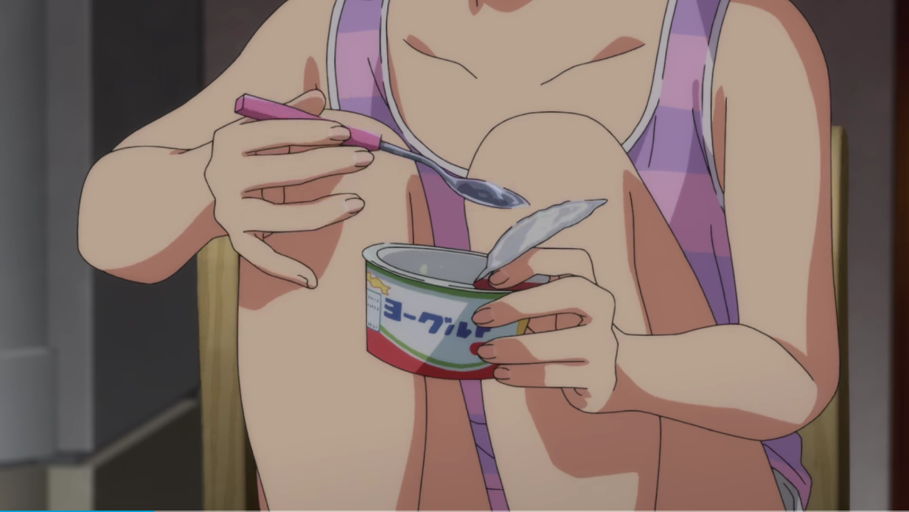


**发布于**：檐枫动漫社
**作者**：Santoin
**日期**：2021年10月5日
**原文链接**：[【投稿】动画OP与ED手法观察 - 二 - 檐枫动漫社](https://mp.weixin.qq.com/s/hSSzfYa2Vwdcr7KRp1GiTA)


みなさんこんばんは。

因为众所周知的原因，再加上本人确实有点懒，最近已经很少坐在电脑前等着动画的更新然后即刻收看。更多的可能是挑自己有时间的时候把之前没看的一口气补完。虽说补番的话，很容易只看一遍 OPED，之后就跳过了，但有些动画的 OPED 仍然给我留下了非常深刻的印象。

虽然在下面列举的动画的 OPED 中，有一些可能没法讨论其手法，但在这里也一并介绍，更多是因为个人很喜欢其创意或者设计想法。

当然，我也回顾了一下在三年前写的 [《动画OP与ED手法观察》](https://tackoil.github.io/2019/10/26/oped-view/)，感觉这三年的总结可能没有没有那么多丰富的手法，更多的是一次分享。希望能把这次对各种各样的 OPED 介绍给大家。

<!-- more -->

# 动画OP与ED手法观察2

众所周知，动画的 OPED 不仅仅是放 Staff 表的地方，也是展现动画内容并与主题曲结合的重要位置。做好这两点也是一个优秀的动画 OPED 所必备的工作。

## 1

如何做好上面两点，对于不同的监督而言可能各有想法。有的会把重心放在如何淋漓尽致地展现动画的精彩之处。

《奇蛋物语》这部动画刚上映的时候，不少人应该会被其非常精细的动画所吸引。（当然后面看起来实在做不动了，~~感觉原画都要进医院了~~）但至少这个 OP 透露着监督和团队的决心。无论是截图中这个吃酸奶的细节，还是后面的大户爱跳着碰天梯的动作，都是夸张到离谱的精细。

虽然没有单独买曲子作为 OP，直接改编了日本创作自 1965 年的经典毕业歌曲《巣立ちの歌》，但与整部动画的主题仍然比较契合。~~（可以说是非常省钱了）~~

手法上除了前面极其离谱的精细感之外，也使用了一些结合实景的技术：包括奇蛋出现在桥上的渲染、以及大户爱走在林间小道的背景。使用这样的技术可以更好的贴近生活场景，再结合精细的作画就可以给观众带来真实感和代入感。

当然，希望各位动画从业者，和各位画师不要这么拼命。注意身体啊。

---

如果说《奇蛋物语》是通过非常精细的作画吸引观众，将真实感贯穿 OP 始终。那么《映像研》就是另一个极端———把不真实感贯穿始终。

高饱和、扭曲、元素拼贴、奇怪的舞蹈。可以说这部 OP 几乎完全脱离常规，仿佛像在一堆奇幻的元素符号中梦游。但这些元素符号也恰恰体现了动画中天马行空的想象这一特点。动画中大量出现剧情世界与想象世界的反复横跳，所以笔者觉得非常符合动画的风格。感觉这篇 OP 的作者真的很有勇气。

> ps 我觉得 OPED 选 rap 的都是天才。
> pss 这个截图里的元素居然有制作方的 LOGO。

## 2

选 rap 这件事，也是促使我写这篇文章的一个重要契机，也就是下面这张截图。

《龙女仆》第二季的 OP 还是挺另笔者眼前一亮的。笔者是先听了 OP 曲后看的动画，这就导致在看动画时便携带着一个问题：如何把一首 rap 做成一个正常的动画 OP？这篇动画给出的答案还是很令我满意的，这部 OP 绘制了每一位角色非常细致的 rap 动作来填充这一部分，并比较细致的对了口型，从而使这一段不会显得无趣。

当然，还是很有《日常》既视感的。但相比《日常》来说，每个人物的动作更加细致和丰富，镜头拉近的过程中人物也有小幅度的动作，大概这就是技术的进步吧。（石原立也：我致敬我自己）

---

> 好像这部动画的 OP 也有 rap 诶。

《奇巧计程车》这部动画在叙事上有一点像日剧，笔者认为还算是一部不错的作品。OP 选用了一首比较爵士风格的曲子，确实会有一种在深夜出租车的广播里听到这样一首歌的感觉。作画部分，在衬词部分让所有角色在这里做一些有摇摆感的动作，给人一种比较放松的感觉。

另外就是这部 OP 都使用了类似水彩画或者简笔画的笔触，再加上出场角色都是动物拟人，因此看起来就更像是绘本，也减少了动物拟人在真实人类城市的违和感。

## 3

当然，除了做好基本工作，如果能让人在 OP 或者 ED 令人眼前一亮，也可以说是巨大成功了。当然，这样的眼前一亮可能不依赖于精湛的作画或者精巧的剧情，可能只需要一些创意。

《佐贺》第二季的 OP 非常巧妙地把 MG 元素和动画角色融合在一起。个人觉得更加高超的地方在于其还巧妙地把 3D 元素和 2D 元素融合在了一起。整个 OP 一直在 3D 与 2D 中反复切换，并使用 3D 的透视变化去构成 2D 元素，非常巧妙。~~（尤其是最后的 MAPPA）~~

虽说使用公交牌作为 MG 元素已经不算罕见了（比如《街角魔族》），但这里也非常成功地做出了自己的风格和特色，这还是很难得的。

---

《堀与宫村》这部动画的 OP，最突出的地方就是这个图片间的切割的移动了。与普通的图片流不同的是，屏幕中的多个区块可能会显示同一区域的不同画面。例如走廊拐角、向日葵花田、还有截图中的这件教室。此外这间教室虽然同时出现了4个人，但每个人在不同的区块中，所处的季节也各不相同。用各种错觉给观众眼见一亮的感觉。

另外很巧妙的事，利用这个移动的区块，把 Staff 表藏在其中。不知道 NCOP 还会不会有 Staff 的这个白色背景框。

---

《咒术回战》的 ED 从“让人眼前一亮”的角度来说，可谓让人眼前一亮（喂）。这种故意很潦草的、将颜色涂出区域外或者图不满的上色风格可能会在某些海报上见到，这里结合 JAZZ 使用显然是更加突出涂鸦的随意感觉。~~（你看人物动作这么复杂，肯定是有钱没处花了）~~

而 ED2 则大量使用了这种不稳定的、逆光、对不上焦的镜头，应该是想模拟手机拍摄的效果。结合 ED 里悠仁拿手机录像的镜头来看，应该是表达这样的含义。当然，从制作上也可能是先用手机拍了一段，然后将绘画的素材叠在上面达到这样的效果。但即便如此，这段对手机录像的模拟也充满的真实感。~~（你看这么光污染，肯定是有钱没处花了）~~

---

当然，眼前一亮也并不是需要很多钱。就像前面提到的，运用一些海报中的手法也会让画面变得非常酷。

《异度侵入》这部动画的 ED 用了当时非常常用的将人物与风景图重叠起来的海报制作方法，大概检索了一下叫“双重曝光”风格。大概原理也是用一层人物作为风景图的滤色，用一层人物作为风景图的蒙版，最后调下各部分的透明图就可以得到类似的风格了。

上一篇推送可能更多的都是关于与海报设计风格在 OPED 中的应用。显然这个 ED 就比较符合上一篇推送的话题。

## 4

在结语部分想说的内容可能和上次差不多，这些手法和技术从来也不是限制作品的枷锁，而是帮助作者表达其想法和创意的工具。让人看完喊出 awsl 或许只需要一位屑魔女打一个小节标准的 4/4 拍指挥手势。

三年来，随着技术的提高，各个作品的作画愈发精细和完美。但即使这样，可以发现留给这短短 90 秒的想象空间仍然很多，仍然还可以迸发出不少创意让观众眼前一亮。那么就一起期待未来的 90 秒里，创作者们会带来怎样的惊喜吧。

大好きだよ、みんな！